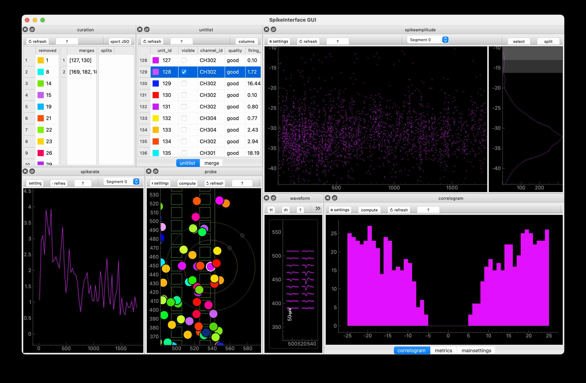

# Clusters

Look at sortings in the Nolan Lab, from Harry, Wolf and Bri's experiments.

## Install

``` bash
git clone https://github.com/MattNolanLab/clusters
cd clusters
```

## Use

Non-trivial things: 1) install [uv](https://docs.astral.sh/uv/getting-started/installation/). 2) set where the derivatives folder is

``` bash
uv run wolf.py 3 4 MMNAV1 --deriv_folder /Volumes/cmvm/sbms/groups/CDBS_SIDB_storage/NolanLab/ActiveProjects/Wolf/MMNAV/derivatives
```

Something like this should pop up (can take a minute to load the data if loading from the DATASTORE):

 

Recommended: change the default deriv folder when you clone this repo